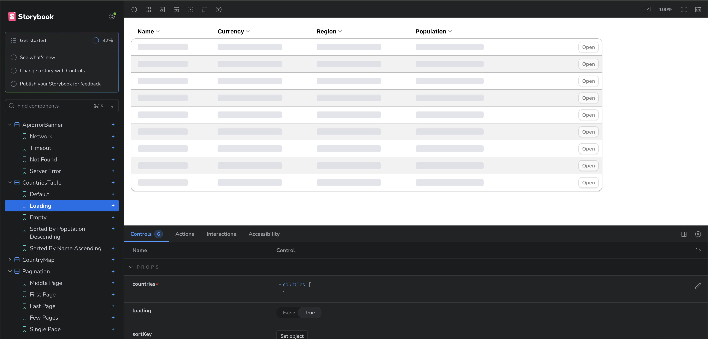
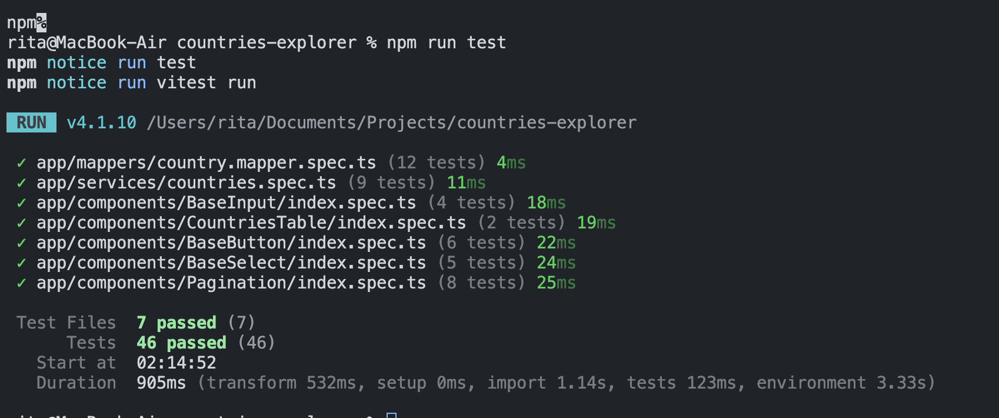
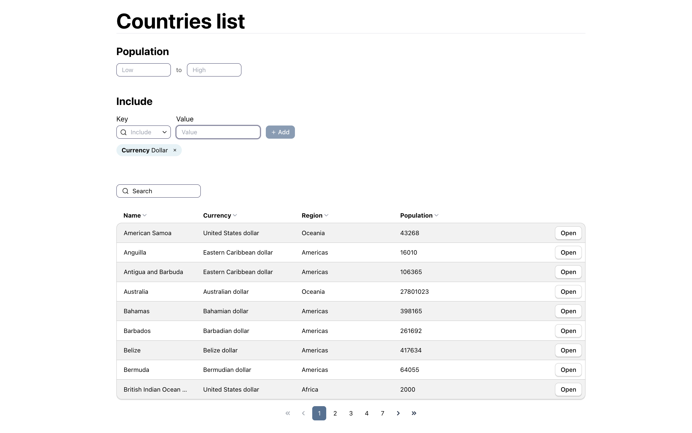
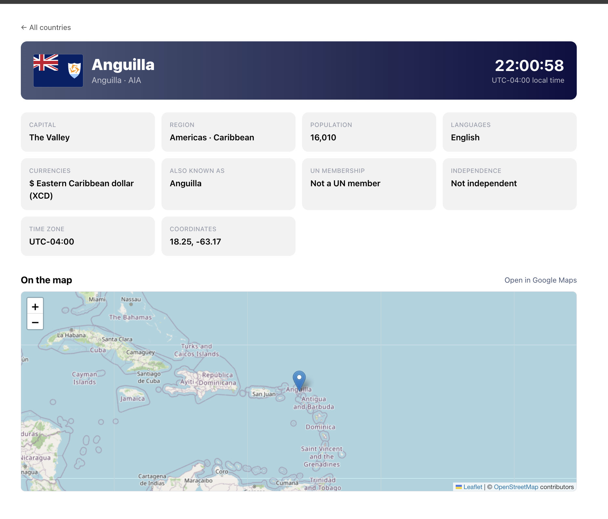
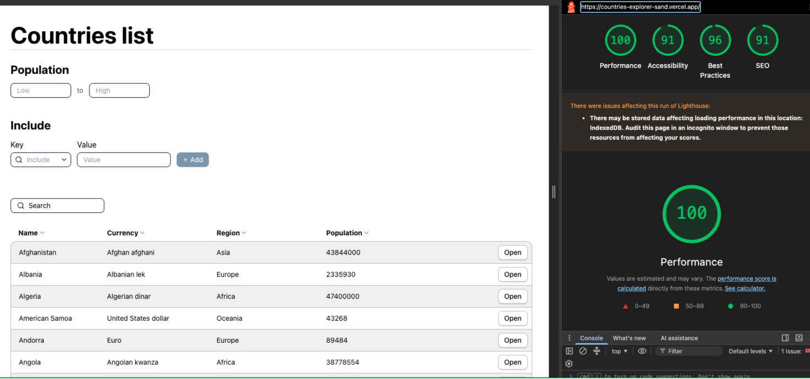
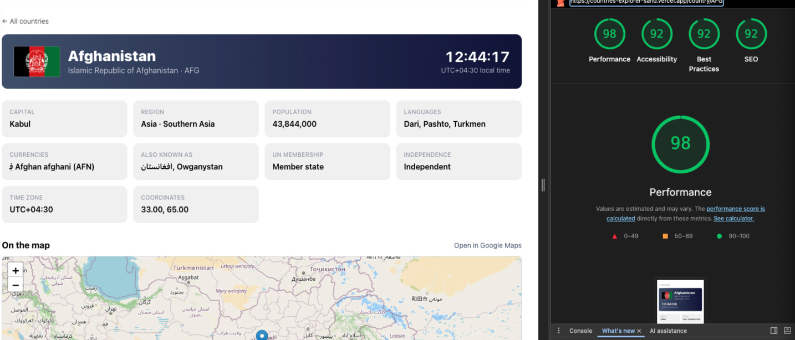
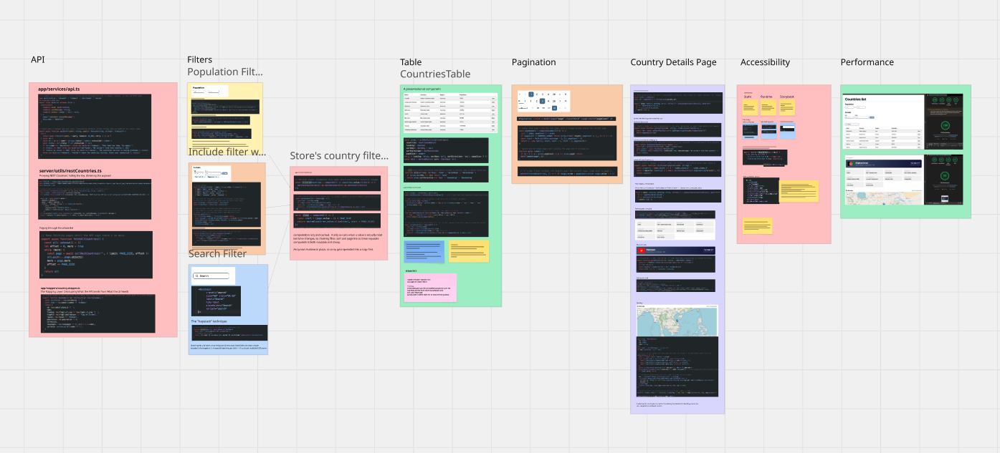

# Countries Explorer







https://miro.com/app/board/uXjVH34UtiQ=/?share_link_id=5290725158


## Stack

Nuxt 3 · Vue 3 · Pinia · Tailwind CSS · Leaflet · Vitest + vitest-axe · Storybook

## How it works

**List page (`/`)** — `server/api/countries` fetches the full country list from the REST Countries API server-side (keeps the API key private) and maps it to a simpler view-model. The Pinia store (`stores/countries.ts`) loads that list once and does all filtering, sorting and pagination client-side, so the list page itself just renders store state.

**Detail page (`/country/[id]`)** — fetches a single country independently via `useAsyncData`, keyed by the route param, with its own loading skeleton and error state. No dependency on the list page's data.

Both pages share the same error handling: `services/api.ts` turns failed requests into a typed `ApiError` (timeout / not-found / server / network), rendered by `ApiErrorBanner` with a retry action.

## Styling

Tailwind utilities, composed into component classes (`.hero`, `.btn`, `.stat-card`, …) under `@layer components` in `main.css`, so templates stay short. Design tokens (colors, shadow) are CSS custom properties shared between `main.css` and `tailwind.config.ts`.

## Accessibility

Three automated layers, so a regression has to slip past all of them to ship:

- **`eslint-plugin-vuejs-accessibility`** lints every `.vue` file on save (`npm run lint:a11y`) — catches missing labels, invalid ARIA, and similar structural issues before the code even runs.
- **`@storybook/addon-a11y`** runs axe-core against each component's rendered story, so visual issues (contrast, focus order) surface while building the component in isolation.
- **`vitest-axe`** asserts zero violations per component in the Vitest suite itself, so a11y regressions fail `npm run test` in CI, not just a manual check.

Plus manual patterns used throughout the app:

- **`BaseSelect`** implements the ARIA combobox "virtual focus" pattern — real DOM focus stays on the trigger button; `aria-activedescendant` tells assistive tech which option is active, with full arrow-key/Enter/Escape support.
- **Labels are always present**, even when hidden visually — `hide-label` on `BaseInput`/`BaseSelect` moves the label to `sr-only` rather than removing it.
- **Loading states are announced**: `CountriesTable` sets `aria-busy` + a `sr-only` caption while loading; the country detail skeleton uses `role="status"`.
- **Focus is always visible** — every interactive element uses `focus-visible:ring-2`, never relying on color alone.
- **`prefers-reduced-motion`** is respected globally (`main.css`), collapsing animations/transitions to near-zero duration.

## Running locally

```bash
npm install
npm run dev         # http://localhost:3000
npm run test         # vitest
npm run typecheck     # nuxt typecheck
npm run storybook    # http://localhost:6006
```

Requires a `.env` file with:

```
NUXT_REST_COUNTRIES_API_KEY=your_key_here
```
## Hours spent

Apprx 4h

## Trade off

My goal was to include as many tests and accessibility checks I could and to include storybook so most of my time went there. For that reason the visual part is not 100% on point  with spacing, border radius etc. I trid to bring it as closes as possible to the figma but I wanted to include everything that would be important to me to be added in, in a real life role as well and accessibiity checks and storybook would be equally important. 

